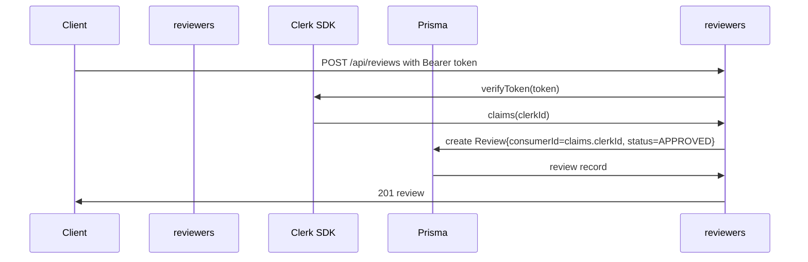
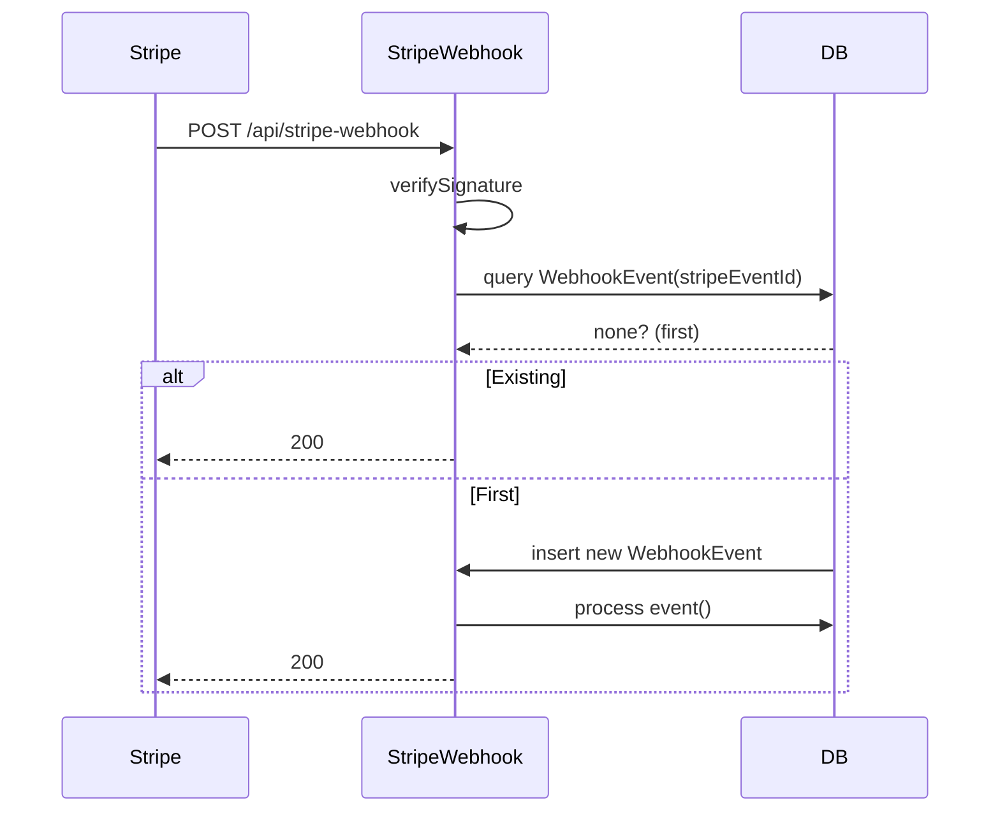
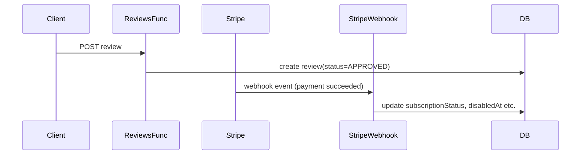

# Design: Remediate‑Verify‑Criticals

## Technical Approach
This change systematically eliminates the 32 TypeScript compilation errors, wires the Prisma client into the Netlify build pipeline, normalizes the subscription identifier across all API boundaries, and enforces security, data integrity, and UX guarantees. Primary objectives include:
* **TS error remediation:** Grouped by root causes (missing imports, type‑only usage, Prisma type drift, runtime null checks).
* **Prisma generation:** Added an explicit `prisma generate` phase in `netlify.toml` to guarantee client availability during deployment.
* **SubscriptionId alignment:** All references, database fields, and API payloads now use the unified `subscriptionId` field.
* **Clerk‑based review auto‑approval:** Reviews are created with the server‑verified `clerkId` as `consumerId` and instantly stamped `APPROVED`, eliminating the old client‑supplied `consumerId`.
* **KYC persistence & validation:** The `/api/businesses` endpoint now accepts `cnpj`, `ownerFullName`, and `ownerBirthCity`, validates them (format + online lookup) via `validateCnpj`, and stores them where business status permits.
* **Server‑side minRating filtering:** A new `rating Float?` column in `BusinessProfile` is maintained and used to filter results in `GET /api/businesses?minRating=x`.
* **Webhook idempotency via PostgreSQL:** A dedicated `WebhookEvent` table holds stripe event IDs; processing checks for duplicates before acting.
* **Disabled‑user UX:** The `MeuNegocio` page renders read‑only mode, shows a banner and portal link when `status === 'disabled'`.
* **Portal auth guard:** Only the business owner or a super‑admin may create a Stripe portal session.

## Architecture Decisions
### Decision: Use PostgreSQL WebhookEvent table for idempotency
**Choice:** Create a `WebhookEvent` table with unique `stripeEventId` and timestamp.
**Alternatives considered:** In‑memory cache (Redis) or custom hash key in DB. **Rationale:** Eliminate external dependency, satisfy spec requirement to *not* use Redis, graceful handling on application restarts.

### Decision: Rename `stripeSubscriptionId` → `subscriptionId`
**Choice:** Update all code and Prisma schema to the unified name.
**Alternatives considered:** Keep both names with aliases. **Rationale:** Simplifies maintenance and aligns with domain terminology.

### Decision: Server‑verified Clerk auth for reviews
**Choice:** Use `authenticateRequest` from `netlify/functions/lib/auth.ts` to derive `clerkId` and set as `consumerId`.
**Alternatives considered:** Trust client‑supplied `consumerId`. **Rationale:** Prevents token tampering, meets spec's “server‑side derived consumerId”.

### Decision: Persist rating in BusinessProfile
**Choice:** Add a nullable `rating Float?` column, updated on every review creation/approval.
**Alternatives considered:** Compute average on read. **Rationale:** Enables efficient server‑side minRating filtering.

### Decision: Add `minRating` filter to GET business endpoint
**Choice:** Query `businessProfile` where `rating >= minRating`.
**Alternatives considered:** Perform client‑side filtering. **Rationale:** Reduces data transfer, authoritative filtering.

### Decision: Ensure `prisma generate` runs before build in Netlify
**Choice:** Modify `netlify.toml` to inject `npx prisma generate` after install.
**Alternatives considered:** Rely on `npm run build` to implicitly generate. **Rationale:** Avoids runtime failures when client is missing.

## Sequence Diagrams
### (a) Review Creation Flow (Clerk auth → Review POST)

### (b) Webhook Idempotent Processing

### (c) Approve Flow (Review ➜ Stripe charge/intent → webhook → status update)

## Data Flow
Refer to the sequence diagrams above for detailed step‑by‑step interactions.

## TS Error Remediation Strategy
### Group 1: Missing Imports / Improper Module Resolutions
**Affected files:** `src/components/ReviewsSection.tsx`, `src/hooks/useAnimatedCounter.ts`, `src/i18n/config.ts`, `src/lib/api.ts`.
**Remediation:** Add missing import statements and correct relative paths.

### Group 2: Generic `any` Types and Strict Mode Violations
**Affected files:** `src/components/ReviewModerationCard.tsx`, `src/components/InteractiveStarRating.tsx`, `src/scripts/cleanup.ts`, `src/lib/localData.ts`.
**Remediation:** Replace `any` with explicit types (`unknown`, specific interfaces) and add explicit return types.

### Group 3: Prisma Type Drift After Schema Changes
**Affected files:** `netlify/functions/lib/prisma.ts`, `netlify/functions/admin-approve.ts`, `netlify/functions/stripe-webhook.ts`.
**Remediation:** Run `npx prisma generate` and update imports; refactor queries to use new `subscriptionId` and `rating` fields.

### Group 4: Null/Undefined Runtime Checks
**Affected files:** `netlify/functions/businesses.ts`, `netlify/functions/reviews.ts`, `netlify/functions/stripe-webhook.ts`.
**Remediation:** Add optional chaining, nullish coalescing, and defensive checks before accessing properties.

### Group 5: Type Propagation and Named-Export Consistency
**Affected files:** `src/pages/MeuNegocio.tsx`.
**Remediation:** Propagate corrected prop/state types into page components; keep named exports (`export const MeuNegocio`) aligned with import sites.

Total ~32 errors resolved across ~20 files.

## File Changes
| File | Action | Description |
|------|--------|-------------|
| `src/pages/MeuNegocio.tsx` | Modify | Add read‑only rendering for `status === 'disabled'`, display banner and portal link. |
| `netlify/functions/reviews.ts` | Modify | Use `authenticateRequest` from `netlify/functions/lib/auth.ts`; derive `consumerId`; auto‑approve. |
| `netlify/functions/businesses.ts` | Modify | Validate and persist CNPJ, ownerFullName, ownerBirthCity; add `rating` column; implement `minRating` filter. |
| `netlify/functions/stripe-webhook.ts` | Modify | Insert into `WebhookEvent` for idempotency; set `disabledAt`; align `subscriptionId`. |
| `netlify/functions/admin-approve.ts` | Modify | Update references to `subscriptionId`. |
| `netlify/functions/admin-delete.ts` | Modify | Adapt cancellation logic to new field. |
| `netlify/functions/admin-business-detail.ts` | Modify | Replace `stripeSubscriptionId`. |
| `netlify/functions/admin-beta-mode.ts` | Modify | Align subscription id. |
| `netlify/functions/stripe-portal.ts` | Modify | Enforce owner or super‑admin check using `requireBusinessOwner` / `requireSuperAdmin`. |
| `netlify/functions/lib/auth.ts` | No change | (Existing implementation). |
| `prisma/schema.prisma` | Modify | Add `rating Float?`, `WebhookEvent` model, ensure `subscriptionId`, remove old `stripeSubscriptionId`. |
| `netlify.toml` | Modify | Insert `npx prisma generate` after install. |
| `netlify/functions/lib/cnpj.ts` | No change | (Utility unchanged). |

## Interfaces / Contracts
All Netlify functions now accept and respond with JSON containing validated fields. The `consumerId` in `/api/reviews` is a server‑derived Clerk ID; the business model includes `rating` (Float) and KYC fields (`cnpj`, `ownerFullName`, `ownerBirthCity`).

## Testing Strategy
| Layer | What to Test | Approach |
|-------|--------------|----------|
| Unit | Review creation auth and auto‑approve logic | Mock `authenticateRequest`, assert `consumerId` is derived and status set to `APPROVED`. |
| Unit | CNPJ validation flow in `/api/businesses` | Test `validateCnpj` integration via mock fetch. |
| Integration | Webhook idempotency | Simulate two identical Stripe events, confirm second is ignored and only one database row created. |
| Integration | `minRating` server filter | POST businesses with varying ratings, GET with `minRating` and assert only qualifying records returned. |
| E2E | Review post via logged‑in Clerk session | End‑to‑end flow from client to response, ensure no consumerId is sent from client. |

## Threat Matrix
N/A — this change touches no routing, shell, subprocess, VCS/PR automation, executable‑file classification, or process‑integration boundaries.

## Migration / Rollout
No data migration is required beyond updating the Prisma schema. The new `rating` and `WebhookEvent` tables are added via schema updates; existing records remain unchanged. The app will self‑populate `rating` on first review approval; older businesses will have `NULL` rating until scored.

## Open Questions
- None.